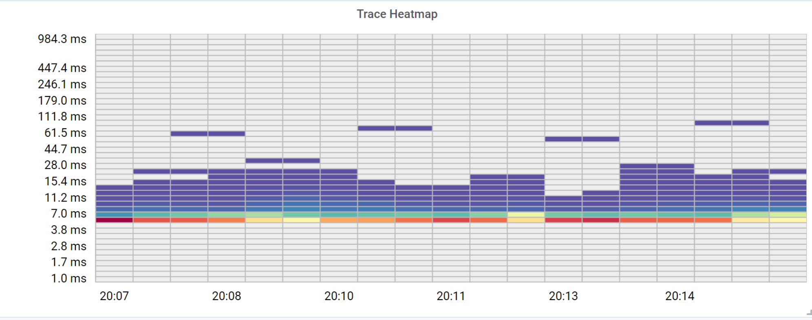

## Develop

1. Clone Grafana and create a symlink to this project's root wherever you have cloned Grafana's repository in the `${GRAFANA_REPO}/data/plugins` directory.
2. Run `yarn install` and `yarn run dev` in this repo. The `dev` script will start webpack in development mode, continuously watching files for changes.
3. In the Grafana root directory, run `sudo make run`.

Whenever you make a change to this repository, you will have to manually refresh the browser window, since Grafana will not pick up changes made in `${GRAFANA_REPO}/data/plugins`.

## Purpose

This panel provides an improved heatmap visualization from bucketed histogram data (e.g. from Prometheus or Netflix Atlas).

Some advantages over the Heatmap panel included in Grafana:

1. Zero values are light gray instead of interpolated on the color spectrum, so it's easier to distinguish zero and near zero values.
2. The y-axis has settable bounds and y-axis labels never overlap.
3. The x-axis is time-scale aggregable, allowing you to set a maximum number of x-ticks. In this way you can visualize a large timescale without displaying many thousands of individual buckets which obscure the data and make the visualization perform badly.